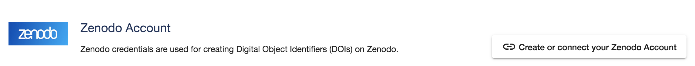
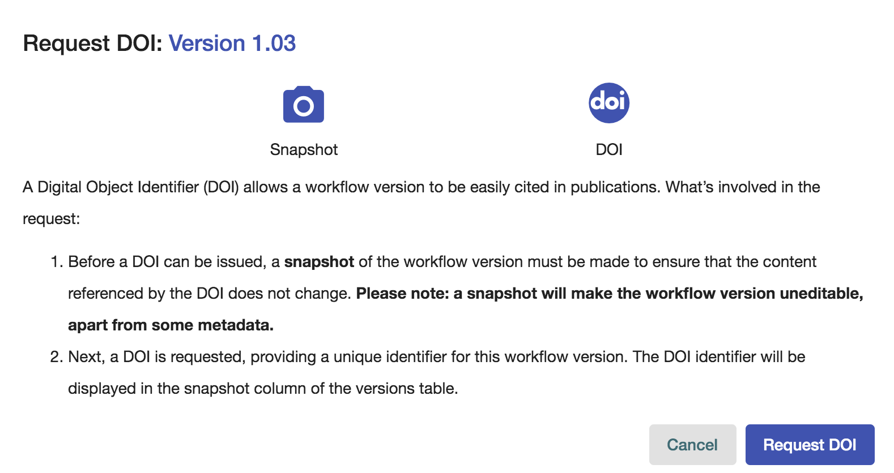
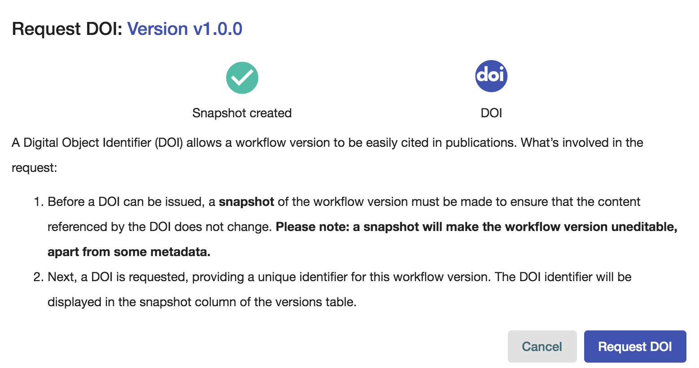

Creating Snapshots and Requesting DOIs
=============================================

Introduction
------------------
Starting in Dockstore 1.7.0, users can create snapshots and Digital
Object Identifiers (DOIs) for their workflows. The ‘Snapshot’ and
‘Request DOI’ actions can be found on the versions tab of any published
workflow on the ‘My Workflows’ page. These features are specific to
individual versions of a workflow entry.

Connect Zenodo Account
----------------------
Dockstore uses `Zenodo <http://about.zenodo.org/>`__ as its DOI provider. A Zenodo account is
required to request a DOI for a workflow version. Link your Zenodo credentials to your Dockstore account on the
`accounts page <https://dockstore.org/accounts?tab=accounts>`__. Requesting a DOI on Dockstore will
create a public entry on Zenodo and upload associated files.

Create Snapshot
----------------
A snapshot is a point-in-time capture of the descriptor(s), test parameter file(s),
and metadata associated with a workflow version. Snapshotting a version will also
make the version immutable. Users will be prompted to confirm before generating a snapshot.
**Taking a snapshot cannot be undone**.

What are the requirements to snapshot?
---------------------------------------
    - The workflow version must have non-empty files.
    - For workflows hosted on an external source control repository,
      only versions associated with releases or ‘tags’ can be snapshotted. For example,
      users cannot snapshot a version associated with a Github branch, but can do so for a Github tag.
    - Each version of a workflow hosted on Dockstore.org can be snapshotted (must have non-emtpy files).
    - We recommend following the :doc:`best-practices <./best-practices/best-practices-intro>`
      before creating a snapshot

What is included in a snapshot?
-------------------------------

The snapshot will contain the same files collected when selecting ‘export as zip’
on the info tab of the workflow version’s landing page. The inclusion of imports in
the snapshot is limited. Valid local file path imports specified in the primary descriptor
will be included in the snapshot. Imports specified using `http(s)` paths are not included in the snapshot.

Digital Object Identifier (DOI)
--------------------------------
A DOI is a permanent identifier that can be used in publications to identify the exact
version of a workflow or tool. The workflow version must be snapshot before a
DOI can be requested. This snapshot, including associated descriptor, test parameter files,
and metadata, will be included in the entry upload to Zenodo.

The user will be prompted to confirm before creating a DOI, we strongly recommend following the
:doc:`best-practices <./best-practices/best-practices-intro>` before generating a DOI.
The version snapshot and DOI on Dockstore can’t be changed, however metadata editing
may be allowed directly through Zendo, but this is limited. **A DOI request cannot be undone.**

