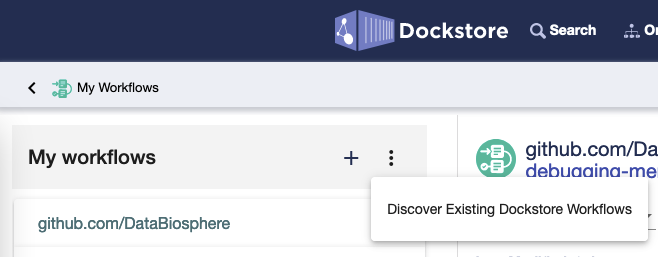

FAQ
===

For questions relating to the Dockstore CLI, please see :doc:`Dockstore CLI FAQ </advanced-topics/dockstore-cli/dockstore-cli-faq>`. 

.. contents:: Table of Contents
  :local:

.. _faq-header-general-dockstore-questions:

General Dockstore Questions
^^^^^^^^^^^^^^^^^^^^^^^^^^^

What environment do you test tools in?
--------------------------------------

Typically, we test running tools in Ubuntu Linux 16.04 LTS on VMs in
`OpenStack <https://www.openstack.org/>`__ with 8 vCPUs and 96 GB of RAM
and above. We've also begun testing on Ubuntu 18.04 LTS and so far it's
been successful. If you are only listing and editing tools, we have
achieved success with much lower system requirements. However, launching
tools will have higher system requirements dependent on the specific
tool. Consult a tool's README or CWL/WDL description when in doubt.

.. _what-is-a-verified-tool-or-workflow:

What is a verified tool or workflow?
------------------------------------

A verified tool/workflow means that at least one version has been verified to be successfully ran on a platform.

See :doc:`/advanced-topics/verification` for full details on this feature.

What is a default version of a tool or workflow?
------------------------------------------------

Every tool/workflow is recommended to have a default version set by its
author. It indicates to the end users which version of the tool/workflow
they should use. For tools, the default version is uniquely identified
by the tag from the Docker image repository. For workflows, the default
version is identified by the Git Reference (which could be a Git tag or
a Git branch). The default version can be set in the 'Versions' tab of a
tool/workflow via radio buttons.

Setting the default version affects a number of elements including (but
not limited to):

1. It determines what is displayed in the 'Description' section of the
   'Info' Tab
2. It is the first version other end users see when no version is
   specified. For example
   https://dockstore.org/containers/quay.io/pancancer/pcawg-bwa-mem-workflow
   is redirected to
   https://dockstore.org/containers/quay.io/pancancer/pcawg-bwa-mem-workflow:develop?tab=info
3. It is the version of the tool/workflow that is launched by default
   when users launch a tool/workflow from the Dockstore CLI.
   For example, if version 1.0 is set as the default version of the
   quay.io/cancercollaboratory/dockstore-tool-bedgraph-bigwig tool,

    ``$ dockstore tool launch --entry quay.io/cancercollaboratory/dockstore-tool-bedgraph-bigwig:1.0 --json Dockstore.json`` 
    
    would be equivalent to

    ``$ dockstore tool launch --entry quay.io/cancercollaboratory/dockstore-tool-bedgraph-bigwig --json Dockstore.json``
4. The docker pull command in the tools search reflects the defaultversion

How should I register my work in Dockstore?
-------------------------------------------

.. include:: /getting-started/how-to-register-work.rst

How do I send private messages to administrators or report security vulnerabilities?
------------------------------------------------------------------------------------

Users are able to open helpdesk tickets on `Discourse <https://discuss.dockstore.org/>`_. Users can create helpdesk tickets in
case of privacy complaints, security vulnerabilities, or any other urgent matter related to Dockstore. Helpdesk tickets will be addressed
by Dockstore administrators.

The following steps can be taken to create a helpdesk ticket (also shown `here <https://discuss.dockstore.org/t/opening-helpdesk-tickets/1506>`_).

1. Navigate to `Discourse <https://discuss.dockstore.org/>`_ and login.
2. Select your profile icon, located in the top right corner of the screen.
3. Select the ``mail`` icon, located in the dropdown.
4. Send a message to the ``dockstore_admins`` group.

.. Note:: If you are unable to see a ``New Message`` button on the mail page, you may be considered a new user and have insufficient privileges. \
   Entering 5 topics and viewing 30 posts over a minimum of 10 minutes will raise your privileges. \
   You will be notified of any privilege changes to your account via the mailbox.

How do I cite Dockstore?
------------------------

For citing Dockstore as a paper, take a look at our `F1000
paper <https://dx.doi.org/10.12688/f1000research.10137.1>`__.

For citing the actual code, we recommend looking at our Zenodo entry.
You will find a variety of citation styles and ways to export it at
|DOI|.

.. _faq-header-github-integration:

Integration with GitHub
^^^^^^^^^^^^^^^^^^^^^^^

What is the difference between logging in with GitHub or logging in with Google?
--------------------------------------------------------------------------------

The intent here is that you should be able to login with either login
method and still conveniently get into the same Dockstore account. With
login via Google, if you are a Terra user you will also have access to
:doc:`sharing functionality </advanced-topics/sharing-workflows>`.

Note that for simplicity, each of your GitHub or Google accounts can
only be associated with one account at a time. You will need to link
with a different account for each login method or delete your account if
you want to assign them to a new Dockstore account.

What happens if I rename my GitHub repository?
----------------------------------------------

When you have registered a tool or workflow from GitHub in Dockstore the
link to the repository for your tool or workflow is displayed on the
Info tab next to 'Source Code'. If you then `rename <https://docs.github.com/en/github/administering-a-repository/renaming-a-repository>`__
the GitHub repository, the Source Code link will display the original name, but
will resolve to the correct GitHub location when you click on it.

Another side effect is that you will be able to register the workflow
again in Dockstore under the new GitHub name, so you effectively
will have registered the same workflow twice.

Please note the GitHub warning: If you create a new repository under
your account in the future, do not reuse the original name of the renamed
repository. If you do, redirects to the renamed repository will break.

.. _faq-header-permissions:

Permissions
^^^^^^^^^^^^

How do I add other users as maintainers of a workflow?
------------------------------------------------------

For workflows registered with GitHub, Dockstore allows users from the same GitHub organization to manage workflows
together. If a new GitHub workflow from the same GitHub organization is added to Dockstore by another user, click
the "Discover Existing Dockstore Workflows" button in the "My Workflows" menu so the workflow will appear in My Workflows.

If the workflow was added by manually registering it, click Refresh Organization.

For participants of the :doc:`limited sharing
beta </advanced-topics/sharing-workflows/>`, you can enter the email
addresses of the users you wish to share with to give them permissions
to your workflow. This is only available for hosted workflows and users
with Google accounts linked to Terra.

Why are my workflows from an organization I belong to not visible?
------------------------------------------------------------------

Organizations have the ability to restrict access to the API for third
party applications. GitHub provides a
`tutorial <https://help.github.com/en/articles/enabling-oauth-app-access-restrictions-for-your-organization/>`__
on how to add these restrictions to your organizations.

In order for Dockstore to gain access to organizations of this type, you
will need to grant access to the Dockstore application. Dockstore will
only be reading information on workflows in your organization and who
has access to them in order to mirror these restrictions on Dockstore
itself. GitHub provides a
`tutorial <https://help.github.com/en/articles/approving-oauth-apps-for-your-organization/>`__
for approving third party apps access to your organization.

Why do I get an error when I try to request a DOI?
--------------------------------------------------

The following error occurs when another user from your GitHub organization has already requested a DOI for a workflow version belonging to the same workflow. 

.. figure:: /assets/images/docs/doi-permission-error.png
   :alt: Request DOI permission error

You are unable to request a DOI because you do not have the permission to create a deposition version for the Zenodo deposit that the other user created and owns. 
Until Zenodo supports the sharing of deposits, only one user of an organization is able to request a DOI. This user is the user who is first to request a DOI for the workflow.

You must ask the user from your organization who already requested a DOI for a workflow version to request a DOI for the workflow version you want. 
You may view the DOI on Zenodo to see who created the DOI by clicking on the workflow DOI or workflow version DOI.

The workflow DOI can be found on the Info tab.

.. figure:: /assets/images/docs/workflow-doi.png
   :alt: Workflow DOI

The workflow version DOI can be found on the Versions tab.

.. figure:: /assets/images/docs/workflow-version-doi.png
   :alt: Workflow version DOI

.. _faq-header-other:

Other
^^^^^

There are too many versions of my tool, how do I delete some?
-------------------------------------------------------------

Versions of your tool for most tools are harvested from the list of Tags
for an image on Quay.io, `as an
example <https://quay.io/repository/pancancer/pcawg-bwa-mem-workflow?tab=tags>`__.
If you have the right permissions, you can delete some and then refresh
a tool on Dockstore to clean-up.

How do I get more space inside my CWL tool running in a container?
------------------------------------------------------------------

There are a couple different answers here. Different directories inside
a container run by CWL are mounted from different locations and will
impose different storage requirements.

Outside the container, the Dockstore CLI will create a directory called
``datastore`` which contains input files provisioned for the running
container. For CWL tools, this directory will include the working
directory (``datastore/<uuid>/working``), the temporary directory
(``datastore/<uuid>/tmp/<random>``), and input files
(``datastore/<uuid>/inputs``).

For the exact breakdown, keep an eye on the invocation of cwltool when
launching a tool. For example, the following means that the containers
working directory is stored at
``/media/dyuen/Data/large_volume/datastore/launcher-22838dbe-044e-4ee5-8532-4cf405222439/working/ZQn2hv``
on the underlying host and the temporary directory at
``/media/dyuen/Data/large_volume/datastore/launcher-22838dbe-044e-4ee5-8532-4cf405222439/tmp/H1xA_N``:

::

    $ dockstore tool launch  --local-entry Dockstore.cwl --json sample_configs.local.actual.json
    Creating directories for run of Dockstore launcher at: ./datastore//launcher-22838dbe-044e-4ee5-8532-4cf405222439
    Provisioning your input files to your local machine
    Downloading: #bam_input from rna.SRR948778.bam into directory: /media/dyuen/Data/large_volume/./datastore/launcher-22838dbe-044e-4ee5-8532-4cf405222439/inputs/8beb90df-f193-493c-b834-ed28973015e3
    Calling out to cwltool to run your tool
    Executing: cwltool --enable-dev --non-strict --outdir /media/dyuen/Data/large_volume/./datastore/launcher-22838dbe-044e-4ee5-8532-4cf405222439/outputs/ --tmpdir-prefix /media/dyuen/Data/large_volume/./datastore/launcher-22838dbe-044e-4ee5-8532-4cf405222439/tmp/ --tmp-outdir-prefix /media/dyuen/Data/large_volume/./datastore/launcher-22838dbe-044e-4ee5-8532-4cf405222439/working/ /media/dyuen/Data/large_volume/Dockstore.cwl /media/dyuen/Data/large_volume/./datastore/launcher-22838dbe-044e-4ee5-8532-4cf405222439/workflow_params.json
    /usr/local/bin/cwltool 1.0.20170217172322
    Resolved '/media/dyuen/Data/large_volume/Dockstore.cwl' to 'file:///media/dyuen/Data/large_volume/Dockstore.cwl'
    [job Dockstore.cwl] /media/dyuen/Data/large_volume/datastore/launcher-22838dbe-044e-4ee5-8532-4cf405222439/working/ZQn2hv$ docker \
        run \
        -i \
        --volume=/media/dyuen/Data/large_volume/./datastore/launcher-22838dbe-044e-4ee5-8532-4cf405222439/inputs/8beb90df-f193-493c-b834-ed28973015e3/rna.SRR948778.bam:/var/lib/cwl/stgc2b37b55-005a-43e5-a824-6caf6656d9c2/rna.SRR948778.bam:ro \
        --volume=/media/dyuen/Data/large_volume/datastore/launcher-22838dbe-044e-4ee5-8532-4cf405222439/working/ZQn2hv:/var/spool/cwl:rw \
        --volume=/media/dyuen/Data/large_volume/datastore/launcher-22838dbe-044e-4ee5-8532-4cf405222439/tmp/H1xA_N:/tmp:rw \
        --workdir=/var/spool/cwl \
        --read-only=true \
        --user=1001 \
        --rm \
        --env=TMPDIR=/tmp \
        --env=HOME=/var/spool/cwl \
        quay.io/collaboratory/dockstore-tool-bamstats:1.25-6_1.0 \
        bash \
        /usr/local/bin/bamstats \
        4 \
        /var/lib/cwl/stgc2b37b55-005a-43e5-a824-6caf6656d9c2/rna.SRR948778.bam
    ...

Also be aware that some tools will use space from your root filesystem.
For example, Docker's storage driver and data volumes will by default
install to and use space on your root filesystem.

Do you have tips on creating Dockerfiles?
-----------------------------------------

-  make sure you `manage Docker as a non-root
   user <https://docs.docker.com/install/linux/linux-postinstall/>`__ on
   your system so you do not need sudo for the ``docker`` command
-  do not call Docker-inside-Docker (it's possible but causes Docker
   client/server issues, it is also not compatible with CWL)
-  do not depend on changes to ``hostname`` or ``/etc/hosts``, Docker
   will interfere with this
-  try to keep your Docker images small

Do you have tips on creating CWL files?
---------------------------------------

When writing CWL tools and workflows, there are a few common workarounds
that can be used to deal with the restrictions that CWL places on the
use of docker. These include:

* cwltool (which we use to run tools) is restrictive and locks down much of ``/`` as read only, use the current working directory or $TMPDIR for file writes 

* You can also use `Docker volumes <https://docs.docker.com/engine/reference/builder/#/volume>`__ in your Dockerfile to specify additional writeable directories

* Do not rely on the hostname inside a container, Docker dynamically generates this when starting containers

Additionally:

-  you need to "collect" output from your tools/workflows inside docker
   and drop them into the current working directory in order for CWL to
   "find" them and pull them back outside of the container
-  related to this, it's often times easiest to write a simple wrapper
   script that maps the command line arguments specified by CWL to
   however your tool expects to be parameterized. This script can handle
   moving output to the current working directory and renaming if need
   be
-  genomics workflows work with large data files, this can have a few
   ramifications:

   -  do not "package" large data reference files in your Docker image.
      Instead, treat them as "inputs" so they can be staged outside and
      mounted into the running container
   -  the ``$TMPDIR`` variable can be used as a scratch space inside
      your container. Make sure your host running Docker has sufficient
      scratch space for processing your genomics data.

.. _why-would-i-want-to-add-a-specific-version-of-a-workflow-to-a-collection:

Why would I want to add a specific version of a workflow to a collection?
-------------------------------------------------------------------------

When creating a collection in an organization, you can pin either a specific version of a workflow or add the workflow in general. This is a flexible system and can mean different things to different organizations. You can elaborate on what this means to you as an organization maintainer in the markdown description associated with a collection. 

As an example, if your organization is responsible for a workflow and its maintenance going forward, you may want to add the workflow to a collection without specifying a specific version. On the other hand, if you are creating an organization for a specific study and you are using a specific version of a workflow that has been screened for security issues and other measures of quality, you may want to pin the specific version of the workflow. You also have the option of adding a workflow to a collection multiple times by bringing up the add dialog if multiple versions of the workflow have been vetted. 

Note that the version of a workflow can be especially important when working with launch-with partners. Some partners will take into account the version of the workflow that you are on wheras other partners will give the option of or require selecting the workflow version when performing a workflow launch. For example, Terra will automatically bring up the version you are currently browsing when performing a launch although you will have an option to override later in the process. 

In summary: you can pin either a specific version of a workflow or a workflow in general depending on what relationship you wish to express. We recommend explaining further for others in the accompanying Markdown description. 

Any last tips on using Dockstore?
---------------------------------

-  the Dockstore CLI uses ``./datastore`` in the working directory for
   temp files so if you're processing large files make sure this
   partition hosting the current directory is large.
-  you can use a single Docker image with multiple tools, each of them
   registered via a different CWL
-  you can use a Git repository with multiple CWL files
-  related to the two above, you can use non-standard file paths if you
   customize your registrations in the Version tab of Dockstore

What happens if I link to a different ORCID account?
----------------------------------------------------

`ORCID <https://orcid.org>`__ is designed to `discourage more than one account for an individual <https://support.orcid.org/hc/en-us/articles/360006971593-Do-you-have-more-than-one-account->`__. However, if you somehow end up with two ORCID accounts, publish a record from Dockstore using the first ORCID account, then relink Dockstore to the second ORCID account, you will not be able to update the original ORCID record from within Dockstore.

If you run into this situation, please use the `Help Desk` link in the https://dockstore.org footer to contact the Dockstore team.

.. |DOI| image:: https://zenodo.org/badge/DOI/10.5281/zenodo.321679.svg
   :target: https://zenodo.org/record/321679

.. discourse::
    :topic_identifier: 1968

