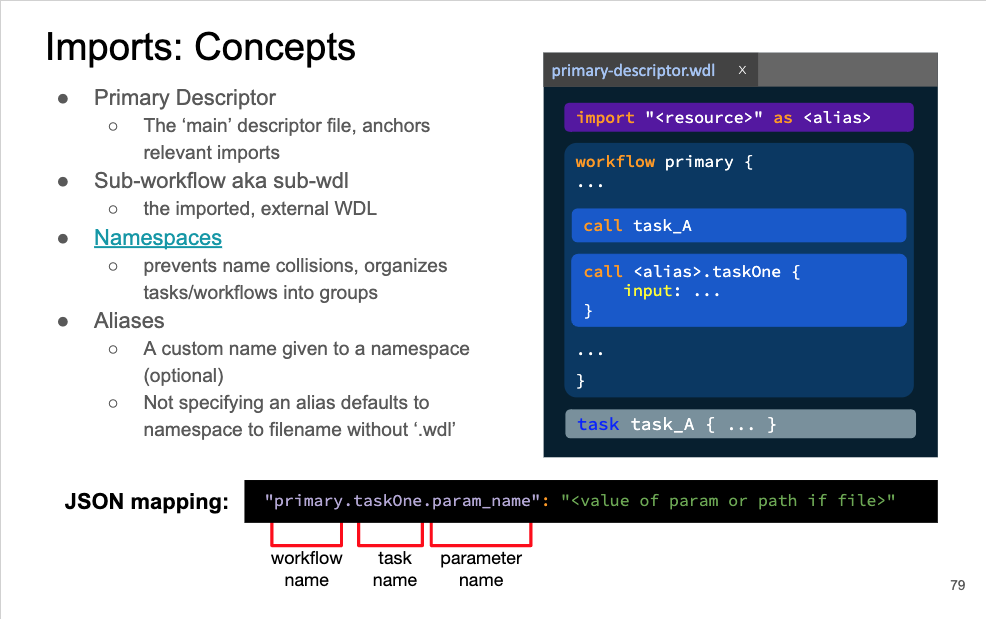

# WDL Training
This tutorial will provide you with an introduction to [WDL](https://openwdl.org/). WDL stands for Workflow Description Language. It is a language for creating complex workflows that can be run locally or in a cloud environment.

## Exercise 1
The Dockstore CLI can be used to run WDL workflows, among other things. Here we will use it to run a Hello World workflow.

Now lets launch the workflow using the Dockstore CLI.

First we will change to the correct directory:
```shell
cd /root/bcc2020-training/wdl-training/exercise1/
```

Now run the hello world workflow:
```shell
dockstore workflow launch --local-entry HelloWorld.wdl --json hello.json
```
Cromwell creates temporary directories to store outputs from a WDL run, this is where you'd find Hello.txt. The identifer for that output will be based on the hello.json file.

The location of this file can be seen in the output provided by the Dockstore CLI and Cromwell. The STDOUT from running the workflow is also stored in `/root/bcc2020-training/wdl-training/exercise2/Cromwell.stdout.txt`, which may be easier to search than your terminal. Look for an "output" object which has a key "metrics.alignment_metrics" which will have the path for the Hello.txt output file.

## Exercise 2
Now we are going to parameterize a simple workflow. The workflow calls the flagstat command of the samtools software. It takes a sam file as input and produces alignment statistics.

The file we will be editing is `/root/bcc2020-training/wdl-training/exercise2/metrics.wdl`.

There are three things to do to complete this exercise (final is optional).
1. Set the runtime to use the samtools Docker container: quay.io/ldcabansay/samtools:latest
2. Parameterize the samtools command in the flagstat task
3. (Optional) If you make any new inputs, be sure to update the metrics.json file in the same directory

To run metrics.wdl:

First navigate to exercise2 director:
```
cd /root/bcc2020-training/wdl-training/exercise2
```
Then run your metrics.wdl:
```
dockstore workflow launch --local-entry metrics.wdl --json metrics.json
```

There are multiple solutions for this exercise. We provided two solutions that can be found at `/root/bcc2020-training/wdl-training/exercise2/solution/` and `/root/bcc2020-training/wdl-training/exercise2/solution2/`
* Solution1 slightly parameterizes the samtools command by feeding it the `input_sam` input parameter instead of the hardcoded filename. 

* Solution2 is slightly more complex. It uses the WDL standard library function `basename()` and uses a parameterized docker_image instead of a hardcoded one. 

The main differences is that solution2 will name the output file based on the name of the input file, 
whereas solution 2 will name the output file `mini.sam.metrics`. This along with the parameterized docker_image name will make it easier to repurpose. However, you may still want to hardcode the docker image into the descriptor to make things more secure and precisely reproducible.  

## Exercise 3
For the final exercise we are going to make a workflow that calls two tasks:
- The first task uses bwa to align FASTQ sequence files to a reference. It produces a SAM alignment file.
- The second task uses the samtools flagstat (metrics) command to evaulauate an alignment file (sam or bam) and generates statistics about the alignment.

We walked through the two individual workflows for these tasks in `aligner.wdl` and `metrics.wdl` respectively.
You can find these individual workflows and their JSON files in `/root/bcc2020-training/wdl-training/exercise3/parts`
 
Now you will combine the individual tasks in the workflows into one single multi-task workflow. 
There are two ways we can approach this exercise and a skeleton file is provided for each approach:

- without using imports: align_and_metrics.wdl
- using imports: align_and_metrics_imports.wdl

To navigate to the exercise3 directory and find the resources:
```
cd /root/bcc2020-training/wdl-training/exercise3
```
If *not using* imports run align_and_metrics.wdl from the exercise3 directory by:
```
dockstore workflow launch --local-entry align_and_metrics.wdl --json align_and_metrics.json
```
If *using* imports run align_and_metrics_imports.wdl from the exercise3 directory by: 
```
dockstore workflow launch --local-entry align_and_metrics_imports.wdl --json align_and_metrics.json
```
To help you in this exercise, you can find the files for the HelloGoodbye examples in: `/root/bcc2020-training/wdl-training/exercise3/hello_examples/`

Both the import and non-import solutions to exercise3 can be found in: `/root/bcc2020-training/wdl-training/exercise3/solution/`

For help with imports:


